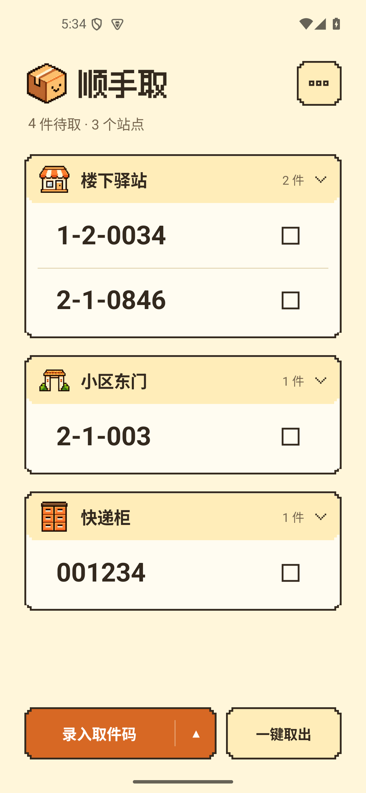
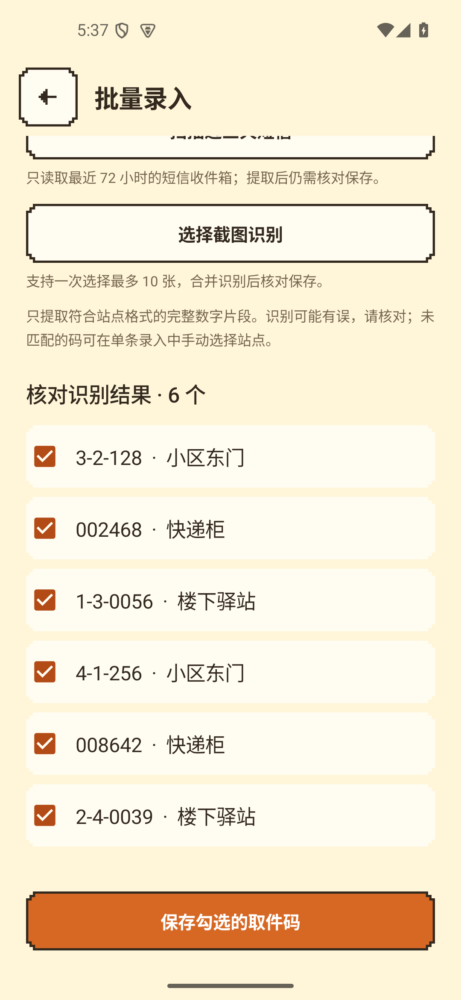
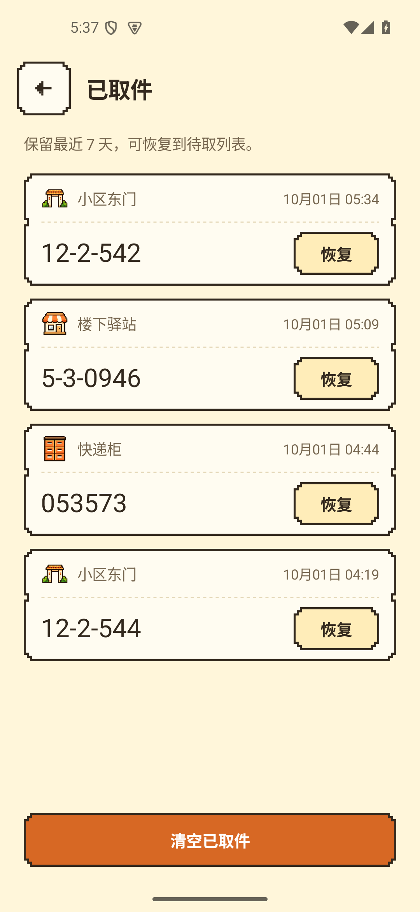

# 顺手取

### 取件码，顺手记。快递，顺路取。

轻巧的安卓快递取件码管理工具 · 奶油色像素界面 · 数据只在本机

**Shunshouqu — an offline Android parcel pickup code manager.**

**[下载安卓安装包](https://github.com/Chocky1126/shunshouqu/releases/latest)** · [使用指南](docs/user-guide.md) · [更新记录](docs/changelog.md) · [反馈问题](https://github.com/Chocky1126/shunshouqu/issues/new/choose)

如果顺手取让你少翻一次短信，欢迎点一下右上角 **⭐ Star**，也把它分享给常取快递的朋友。

---

## 把散落的取件码，放进一张清单

快递到了几个不同站点，取件码却散落在短信和截图里？顺手取可以提取取件码，按你设置的格式自动分站点、按数字排序。到站后点方框或左滑完成取件，也可以一键取出全部。

支持单条与批量录入、最近三天短信提取、多张截图识别、系统分享，以及 **4×4 桌面小部件**。无需注册账号，应用离线运行。

## 看看它的样子

<table>
  <tr>
    <th align="center">按站点整理</th>
    <th align="center">批量核对后保存</th>
    <th align="center">取过的码也能恢复</th>
  </tr>
  <tr>
    <td></td>
    <td></td>
    <td></td>
  </tr>
</table>

截图来自 v1.7.10，取件码均为演示数据。保留应用真实界面。

## 让取件少几步

| 功能 | 能帮你做什么 |
| --- | --- |
| 🏪 自定义站点 | 设置名称、像素图标和取件码格式，录入后自动归类 |
| 🔢 自动排序 | 每个站点内按各段数字升序排列，保留前导零 |
| 💬 短信提取 | 主动扫描最近 72 小时收件箱，过滤待取和最近 7 天已取码 |
| 🖼️ 截图识别 | 一次最多选择 10 张截图，在本机识别，核对后保存 |
| 📋 多种录入 | 单条、批量、手动指定站点；也可从其他应用分享短信或图片 |
| ✅ 快速取件 | 左滑、点方框或一键取出；长按编辑，点站点标题进入大字取件 |
| 🧾 已取记录 | 保留最近 7 天，可恢复到待取，清空前需确认 |
| 🏠 桌面小部件 | 4×4 小部件最多展示 6 条码，可逐件完成或一键取出 |
| 🎨 显示调整 | 取件码字号、行距可选，放置天数达到阈值时在应用内提示 |

## 下载与开始使用

1. 打开 **[最新正式版](https://github.com/Chocky1126/shunshouqu/releases/latest)**，下载名称以 `arm64.apk` 结尾的安装包。支持 Android 8.0 及以上的 ARM64 设备。
2. 在右上角菜单的“站点设置”中，改好常去的站点名称与格式。`x` 表示一位数字，多种格式每行一种，例如 `x-x-xxx` 和 `xx-x-xxx`。
3. 点“录入取件码”添加单条，或点旁边的上箭头，选择批量录入、截图识别、扫描短信。识别结果核对后再保存。
4. 取完点方框或左滑，误操作可在“已取快递”中恢复。

**升级请直接覆盖安装，不要先卸载或清除应用数据。** 卸载或清除数据会删除本机记录。

桌面小部件入口：右上角 → 更多设置 → 添加到桌面，也可从系统的“小部件 / 插件”列表添加。

## 隐私与权限

- 无账号、无云同步，取件数据存储在本机；应用不申请网络权限。
- 短信读取只在你主动扫描并授权后触发，只查询近 72 小时的收件箱，不保存短信全文，不进行后台自动扫描。
- 图片通过系统选择器读取，截图识别使用内置模型，不需要下载模型或上传图片。
- 不申请相机、通知、开机广播或全盘存储权限；放置天数提示仅在应用内显示。

## 常见问题

<b>取件码没有自动识别到站点怎么办？</b>

先检查站点格式。特殊格式可用右上角菜单的“手动录入”自行指定站点。短信和截图识别可能有误，保存前请核对。完整规则见 [使用指南](docs/user-guide.md)。

<b>短信权限没有授予，或者桌面没有显示小部件？</b>

短信权限受系统和安装来源限制，可改用系统粘贴、分享或截图录入。小部件通过标准 Android 接口实现，请在系统“小部件 / 插件”列表查找；部分桌面可能不支持自动添加。OPPO 的专有“全部卡片”与标准小部件入口不同。

<b>支持哪些手机？升级会丢失数据吗？</b>

当前安装包支持 Android 8.0 及以上的 ARM64 设备，覆盖安装沿用此前交付签名。包名为 `cn.pickup.pocket`。用户曾报告 OPPO Find X8 / ColorOS 16 短信扫描正常，其他系统的权限与桌面行为可能不同。

## 一起把它做得更顺手

喜欢这个小工具，可以 **Star 收藏**，或分享仓库链接：

> 顺手取：一个离线的安卓快递取件码管理工具，支持短信提取、截图识别、自动分站点和桌面小部件。
> https://github.com/Chocky1126/shunshouqu

遇到问题请 [提交反馈](https://github.com/Chocky1126/shunshouqu/issues/new/choose)，附上应用版本、手机型号、系统版本和复现步骤。欢迎建议、文档改进和代码贡献，见 [贡献指南](CONTRIBUTING.md)。

## 开发与致谢

原生 Android / Java · SQLite · ML Kit 本机文字识别 · Android AppWidget。

[开发与构建](docs/developer-guide.md) · [功能地图](docs/feature-map.md) · [交付与验证](DELIVERY.md)

像素插画由 Image Gen 为本应用生成。图标来自 [Pixelarticons](https://github.com/halfmage/pixelarticons)，标题使用 [Fusion Pixel Font](https://github.com/TakWolf/fusion-pixel-font) 字形子集。第三方资源授权见 [licenses](licenses) 与 [说明](THIRD-PARTY-NOTICES.md)。
